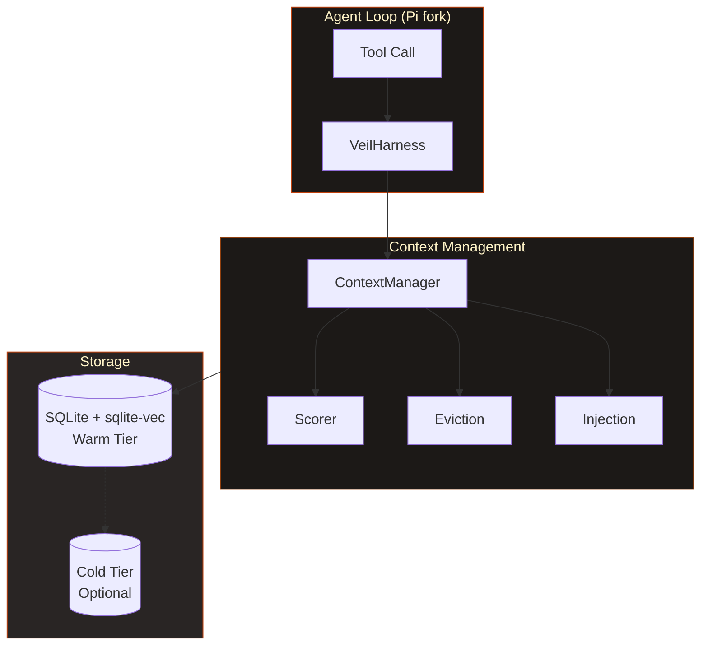

<div align="center">


**Your agent forgets. This one doesn't.**

[](https://www.npmjs.com/package/@engrammic/veil)
[](LICENSE)

[Install](#install) ·
[Why Veil](#why-veil) ·
[Features](#features) ·
[vs Alternatives](#vs-alternatives) ·
[Docs](#documentation)

</div>

---

## Install

```bash
# npm
npm install -g @engrammic/veil

# or curl
curl -sSL https://veil.engrammic.ai/install | sh

# Or for windows;
irm https://veil.engrammic.ai/install.ps1 | iex
```

Then run in any project:

```bash
veil
```

---

## Why Veil

Other tools reset every session. Veil remembers.

- **Cross-session persistence** — context survives restarts, not just compaction
- **Local-first** — sqlite-vec embeddings, no cloud dependency, works offline
- **Self-tuning** — FSRS decay learns what matters; stale context fades, important context stays
- **Deterministic** — no LLM in the memory loop, sub-10ms scoring on every turn

---

## Features

<table>
<tr>
<td width="50%">

### Self-Tuning Eviction
*AIMD control*

Context pressure triggers eviction. Success grows the window, failure shrinks it. No manual cleanup.

</td>
<td width="50%">

### Failure Memory
*Loops converge*

Failed approaches are remembered. The agent doesn't grind — it learns what didn't work and moves on.

</td>
</tr>
<tr>
<td width="50%">

### Worldview
*Structural + behavioral*

Persistent understanding of the codebase and your patterns. Survives compaction.

</td>
<td width="50%">

### Compression
*Intelligent decay*

Code, config, and conversations compress based on relevance. Old context fades, important context persists.

</td>
</tr>
</table>

---

## vs Alternatives

Most "memory" solutions are config files with marketing. Veil is infrastructure.

| | Veil | Config-based kits |
|---|:---:|:---:|
| Memory persists across sessions | Yes | No |
| Works offline | Yes | Cloud-dependent |
| Learns what matters (FSRS decay) | Yes | Static rules |
| Semantic search (sqlite-vec) | Yes | Keyword only |
| Survives context compaction | Yes | Hopes for the best |
| Ships as actual code | Yes | CLAUDE.md + vibes |

---

## Architecture



| Path | Behavior |
|------|----------|
| **Fast** | Deterministic scorer + eviction. Every turn, sub-10ms. Never blocks. |
| **Slow** | Reads event log, writes policy. Between turns, off critical path. |

---

## Documentation

| Doc | Purpose |
|-----|---------|
| [CONTRIBUTING.md](CONTRIBUTING.md) | Contribution guidelines |

---

## Development

```bash
git clone https://github.com/engrammic/veil
cd veil
npm install --ignore-scripts
npm run build
./veil-test.sh
```

---

## Credits

Built on [pi-mono](https://github.com/badlogic/pi-mono) by Mario Zechner. MIT licensed.

Part of the [Engrammic](https://engrammic.ai) ecosystem.

---

<p align="center">
  
</p>

<p align="center">
  <sub>Engrammic · 2026</sub>
</p>
